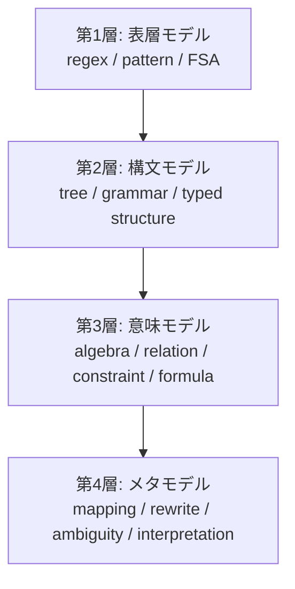

# 4層数理言語モデル案

更新日: 2026-03-28

## 出発点

この構想の出発点は、自然言語を「単なるトークン列」として扱うのではなく、数理的に表現可能な構造として扱うことである。

特に重要な直観は次の通りである。

- 文章の表層は正規表現でかなり表せる
- 文章の意味は数式や関係式としてかなり表せる
- 構文も、木や生成規則や型付き項として表せる
- メタ解釈も、構造間の写像や変換規則として表せる

この意味で、自然言語処理そのものを、段階的な数理構造処理として再設計しようというのがこのモデルである。

## 核心

目指すのは、

`自然言語を、正規表現・代数的項・制約・変換規則の組として表す言語モデル`

である。

ここで重要なのは、数式を「加減乗除」だけに限定しないことだ。必要なのは、より広い意味での代数的表現である。

つまり数式とは、

- 項
- 関数
- 関係
- 制約
- 書換え
- 型
- 写像

を含む数理表現全体を指す。

## なぜ数式と正規表現を先に置くのか

数式と正規表現は、最初のベースとして非常に強い。

理由:

- 定義が明確
- compact に書ける
- 検証しやすい
- 小さいデータで扱える
- 推論コストを低くできる
- 後で拡張しやすい

つまり、最初に作るべきなのは「巨大な万能意味表現」ではなく、まず動く中核としての

- 正規表現モデル
- 代数的数式モデル

である。

## 4層構造

この構想は、次の4層で整理するのが自然である。



## 第1層: 表層モデル

役割:

- 文字列パターンの認識
- 表記揺れの吸収
- 抽出
- 正規化
- 形式制約

主要表現:

- 正規表現
- 有限オートマトン
- トークンパターン
- 文字種クラス

例:

- 郵便番号
- 日付
- 単位付き数値
- 固定フォーマット
- 助詞や終助詞の局所パターン

この層は意味を全部扱うためのものではなく、表層の安価な分解器として働く。

## 第2層: 構文モデル

役割:

- 文や句の階層構造を表す
- 修飾関係や係り受けを表す
- どこまでが一つの意味単位かを決める

主要表現:

- 木構造
- 文法規則
- 型付きノード
- 述語項構造

ここでは、正規表現では表しきれない階層性を扱う。

例:

- 「AがBにCを渡した」の項構造
- 括弧や修飾語のスコープ
- 否定や条件節の係り先

## 第3層: 意味モデル

役割:

- 命題や関係を数理表現に落とす
- 数量関係や法則を保持する
- 制約や同値性を扱う

主要表現:

- 代数的項
- 関係式
- 制約式
- 論理式
- 数式

例:

```text
force = mass * acceleration
```

$$
F = ma
$$

あるいは、

- 所有関係
- 因果関係
- 包含関係
- 同一性

もこの層で扱う。

## 第4層: メタモデル

役割:

- どの解釈を採るか決める
- 曖昧性を候補集合として保持する
- 構造間の変換規則を管理する
- 表層から構文へ、構文から意味への写像を定義する

主要表現:

- 書換え規則
- 写像規則
- 候補集合
- 信頼度
- 解釈ポリシー

この層があることで、自然言語の曖昧性を「エラー」ではなく「表現対象」として扱える。

## 各層の関係

### 第1層は切り分け

正規表現やパターンで、文字列を安価に分解する。

### 第2層は構造化

分解された表層要素を、木や役割構造にまとめる。

### 第3層は意味化

構造を、関係式・数式・制約として記述する。

### 第4層は解釈管理

曖昧性、変換、選択、メタ規則を管理する。

## 重要な点

この4層のうち、最初に実装価値が高いのは第1層と第3層である。

理由:

- 第1層は regex/FSA によって実装しやすい
- 第3層は数式・制約で compact に表せる
- この2つは低コスト推論の恩恵が大きい
- 第2層と第4層は、その上に段階的に積める

つまり、初期研究としては

1. 表層モデル
2. 意味モデル

をまず作り、その橋渡しとして簡易な構文モデルとメタモデルを入れるのがよい。

## Transformer型との違い

Transformer型LMでは、これら4層がほぼすべて重みの中に圧縮される。

この案では、4層をできる限り分離して持つ。

- 表層規則は regex/FSA
- 構文は木や型付き構造
- 意味は数式や関係式
- メタ解釈は候補集合や変換規則

つまり、Transformer が「全体を一つの分布モデルで近似する」のに対し、このモデルは「言語の構造を分解し、それぞれに適した数学的表現を与える」。

## 学習コストと推論コストへの効き方

この設計で重要なのは、何でも学習しないことだ。

- 自明な表層処理は regex/FSA に任せる
- 自明な数量関係は数式や行列演算に任せる
- 法則や制約は明示表現として保持する
- 曖昧な箇所だけモデルに判断させる

これにより、学習対象は「すべて」ではなく、

- どの表現へ写像するか
- どの知識を参照するか
- 曖昧性をどう扱うか

に限定できる。

## なぜTuring完全性を中心に置かないのか

この構想の中心は「何でも実行できること」ではない。

中心は、

- 共有できること
- compact であること
- 正規化できること
- 検証できること
- 低コストであること

である。

したがって、必要な実行能力は付随的な導出層に置けばよい。

## 最初の研究プロトタイプ

最初に作るべきプロトタイプは次のようになる。

### 1. 正規表現モデル

- 数値
- 単位
- 日付
- 固定句
- 形式パターン

を抽出・正規化する。

### 2. 代数的意味モデル

- quantity
- relation
- eq/add/mul/div
- constraint

を表す。

### 3. 軽量マッピング層

表層パターンを意味式へ写像する。

### 4. 曖昧性保持層

複数候補と信頼度を持つ。

この形なら、小さく始めて拡張できる。

## 一文での定義

この4層数理言語モデルは、

`自然言語を、表層パターン・構文構造・代数的意味・メタ解釈の4層に分解し、それぞれを数理的に表現することで、低コストかつ共有可能な言語モデルを実現しようとする設計`

である。
