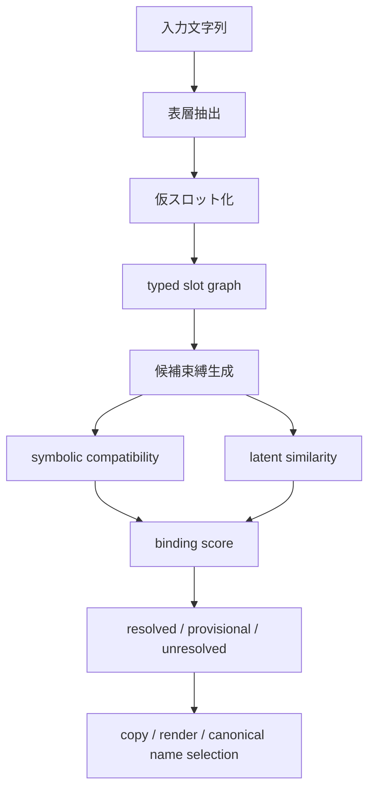

# Lexical Grounding Architecture

更新日: 2026-03-28

## 問題

スロット化は構造学習には有効だが、強すぎる匿名化だけでは失敗する。

特に危ないのは、

- 固有名詞
- 専門語
- 新語
- 文脈で意味が変わる語
- 数式中の記号名

である。

これらは単に `TERM_SLOT_1` や `VAR_SLOT_1` に置き換えるだけでは、意味が抜け落ちやすい。

## 結論

必要なのは
`slot + lexical grounding`
である。

つまり、

- 構造はスロットで抽象化する
- ただし語彙の表記と文脈依存意味は捨てない
- 知識束縛で後から接地する

という設計が必要である。

## 基本原理

重要なのは、
`構造は抽象化するが、語彙接地は保持する`
ことである。

したがって、各スロットは単なる匿名記号ではなく、少なくとも次を持つ。

- `surface`
- `type`
- `local context`
- `usage signature`
- `candidate bindings`
- `binding state`
- `soft embedding`

## スロットの最小形

例:

```lisp
(slot ORG_SLOT_1
  (surface s:"OpenAI")
  (type org)
  (binding unresolved)
  (usage
    (rel subject_of develop)
    (rel modifier ai_model))
  (soft V_128))
```

ここで重要なのは、`ORG_SLOT_1` に置き換えても
`surface = "OpenAI"`
や
`usage`
を失わないことだ。

## なぜ必要か

単純匿名化だけでは、次が壊れやすい。

- entity linking
- 専門語の disambiguation
- copy が必要な出力
- 新語や未登録語への対応
- 同じ型の語どうしの区別

たとえば、

- `OpenAI`
- `Anthropic`
- `Microsoft`

を全部 `ORG_SLOT` にすると、構造は見えても語彙接地が消える。

## 役割分担

### スロット化でやること

- 構文役割の抽出
- 型付き匿名化
- relation graph の骨格構築

### 語彙接地でやること

- surface の保持
- 候補 entity / sense の束縛
- KB との接続
- 未登録語の一時的表現
- copy / render 戦略

## 語彙接地の流れ



## 候補束縛のスコア

自然な scoring は次の積である。

`binding score = symbolic compatibility × latent similarity × context fit`

見るもの:

- 型が合うか
- 周辺 relation が合うか
- surface が近いか
- 文書文脈に合うか
- 既知KB候補と整合するか

## Transformer の役割

この部分では、Transformer は依然として必要である。

ただし役割は `知識倉庫` ではなく、

- 型推定
- 候補意味の ranking
- 文脈依存の用法表現
- 再表現時の自然文生成

に限定される。

したがって、固有名詞処理で Transformer を捨てるのではなく、
`語彙接地器として小さく残す`
のが正しい。

## 出力時の方針

出力では、すべてを新規生成しなくてよい。

自然なのは次の混合である。

- 入力 surface の copy
- KB の canonical name を使用
- unresolved の場合は元表記を保持
- 周辺説明だけ Transformer が生成

これにより、

- 固有名詞の破壊
- 存在しない名前の hallucination
- 意図しない正規化

を減らせる。

## 数式側での接地

数式でも同じである。

- `x`, `y` のような一般変数は強く抽象化できる
- `L`, `H`, `G` のような分野依存記号は文脈接地が必要

したがって、

- `VAR_SLOT`
- `FUNC_SLOT`
- `CONST_SLOT`

だけで終わらせず、

- その記号が lhs に出るか
- gradient の対象か
- 単位を持つか
- どの式群に繰り返し出るか

まで見るべきである。

## 最小実装

最小プロトタイプなら、次で十分である。

1. surface を保持した temporary slot を作る
2. slot type を推定する
3. slot ごとに small embedding を付ける
4. top-k binding 候補を出す
5. unresolved を許す
6. 出力では copy と canonical name を混ぜる

## 一文での整理

この方式が成立する条件は、単純な匿名化ではなく、`構造抽象化と語彙接地を分離した slot + lexical grounding` にすることである。
