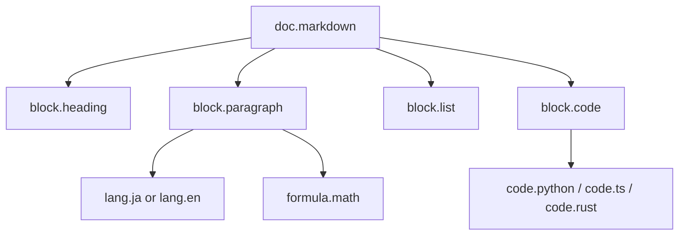

# Markdown混在文書IR仕様

更新日: 2026-03-28

## 目的

この仕様の目的は、Markdown 文書の中に

- 日本語
- 英語
- 数式
- プログラム言語のコードブロック

が混在する文書を、共通の文書構造の上で、それぞれ独立した IR として保持できるようにすることである。

## 基本方針

Markdown は「文書構造」であり、自然言語やコードそのものではない。

したがって、設計は次のように分離する。

- `doc.markdown`
  見出し、段落、箇条書き、表、引用、コードブロックなどを表す
- `lang.ja`
  日本語の表現を表す
- `lang.en`
  英語の表現を表す
- `formula.math`
  数式表現を表す
- `code.python`, `code.ts`, `code.rust` など
  各プログラム言語のコード表現を表す

Markdown は外側の器であり、中身は埋め込み IR として保持する。

## 全体構造



## 1. 文書構造IR

`doc.markdown` は、文書の外枠だけを保持する。

最小タグ:

```text
doc
block
inline
heading
paragraph
list
list_item
quote
code_block
code_span
table
row
cell
link
emphasis
strong
```

役割:

- `doc`: 文書全体
- `block`: ブロック単位
- `inline`: 段落内の部分要素
- `heading`: 見出し
- `paragraph`: 段落
- `list`: 箇条書き
- `list_item`: リスト要素
- `quote`: 引用
- `code_block`: fenced code block
- `code_span`: inline code
- `table`: 表
- `row`, `cell`: 表要素
- `link`: リンク
- `emphasis`, `strong`: 強調

## 2. 埋め込みIRの考え方

各 block や inline は、中身として別の IR を持てる。

そのため、`content` や `embedded` の role を持たせる。

最小 role:

```text
type
lang
content
embedded
surface
meta
```

## 3. 最小文法

```lisp
<doc> ::= (doc <block>*)

<block> ::= (block (type <block-type>) <field>*)

<field> ::= (lang <atom>)
          | (content <embedded-ir>)
          | (surface <string>)
          | (meta <node>)
```

ここで `<embedded-ir>` は `lang.ja`, `lang.en`, `formula.math`, `code.python` などの別IRノードである。

## 4. 例

### 4.1 日本語見出し + 英語段落 + Pythonコード

```lisp
(doc
  (block
    (type heading)
    (lang ja)
    (content
      (stmt
        (assert
          (entity
            (surface s:"実験メモ")))))
  (block
    (type paragraph)
    (lang en)
    (content
      (stmt
        (assert
          (event
            (pred sym:show)
            (arg (role s:"theme")
                 (entity (surface s:"the following code")))))))
  (block
    (type code_block)
    (lang python)
    (content
      (module code.python
        (function
          (name s:"add")
          (params s:"x" s:"y")
          (body
            (return
              (binary_op
                (op s:"+")
                (lhs s:"x")
                (rhs s:"y"))))))))
```

この文書では、見出しは日本語 IR、段落は英語 IR、コードブロックは Python IR でそれぞれ独立に保持される。

### 4.2 日本語段落に数式を埋め込む

```lisp
(block
  (type paragraph)
  (lang ja)
  (content
    (stmt
      (assert
        (relation
          (pred sym:explain)
          (arg (role s:"theme")
               (formula
                 (eq
                   (quantity (id sym:force))
                   (mul
                     (quantity (id sym:mass))
                     (quantity (id sym:acceleration))))))))))
```

$$
F = ma
$$

### 4.3 Markdown リストで日本語と英語を混在させる

```lisp
(doc
  (block
    (type list)
    (content
      (list
        (list_item
          (lang ja)
          (content
            (stmt
              (assert
                (entity (surface s:"目的を定義する")))))
        (list_item
          (lang en)
          (content
            (stmt
              (assert
                (entity (surface s:"Run the benchmark")))))))))
```

## 5. 独立したIRとしての利用

重要なのは、各埋め込みIRが Markdown に依存せず単体利用できることだ。

たとえば、

- `lang.ja` は単独で日本語文解析に使える
- `lang.en` は単独で英語文解析に使える
- `formula.math` は単独で数式処理に使える
- `code.python` は単独でコード解析に使える
- `doc.markdown` は構造解析だけに使える

Markdown 文書内では、それらを `content` として束ねるだけでよい。

## 6. 継承より合成

この仕組みでは、深い継承木を作らない方がよい。

避けたい形:

```text
core -> doc -> markdown -> ja-markdown -> math-ja-markdown
```

代わりに、浅いモジュール合成にする。

推奨形:

```text
core
doc.markdown
lang.ja
lang.en
formula.math
code.python
```

文書ごとに必要なものを組み合わせる。

例:

- 日本語 Markdown 文書:
  `core + doc.markdown + lang.ja`
- 英語技術文書:
  `core + doc.markdown + lang.en + code.python`
- 日本語数式記事:
  `core + doc.markdown + lang.ja + formula.math`

## 7. 依存関係

依存はあるが、各IRは独立利用可能であるべきだ。

最小依存:

- `doc.markdown` -> `core`
- `lang.ja` -> `core`
- `lang.en` -> `core`
- `formula.math` -> `core`
- `code.python` -> `core`

必要なら、文書単位で複数IRを同時に読み込む。

## 8. この設計の利点

### 1. 混在文書を自然に表せる

Markdown 中の日本語、英語、数式、コードを無理なく共存させられる。

### 2. 各IRを独立再利用できる

言語IRやコードIRを、Markdown 以外の場面でも使える。

### 3. 小さいモデルに向く

必要なブロックだけを処理すればよく、全文を単一トークン列として抱えなくてよい。

### 4. 文書構造と内容構造を分離できる

Markdown の論理構造と、中身の意味構造を独立に扱える。

### 5. 更新しやすい

段落だけ、日本語部分だけ、コードブロックだけを差し替えられる。

## 9. 注意点

### 1. 境界管理が必要

どこからどこまでが日本語 IR で、どこからが数式 IR かを明確にする必要がある。

### 2. inline 混在はやや難しい

一つの段落の中に日本語、英語、数式、コード片が混ざる場合、inline 単位の分割が必要になる。

### 3. code IR は言語ごとに別仕様が要る

Python と TypeScript と Rust は別IRとして持つ方がよい。

## 10. 一文での定義

この Markdown混在文書IR仕様は、

`Markdown を外側の文書構造IRとして使い、その各ブロックやinlineの中身に、日本語IR・英語IR・数式IR・コードIRを独立に埋め込めるようにする設計`

である。
