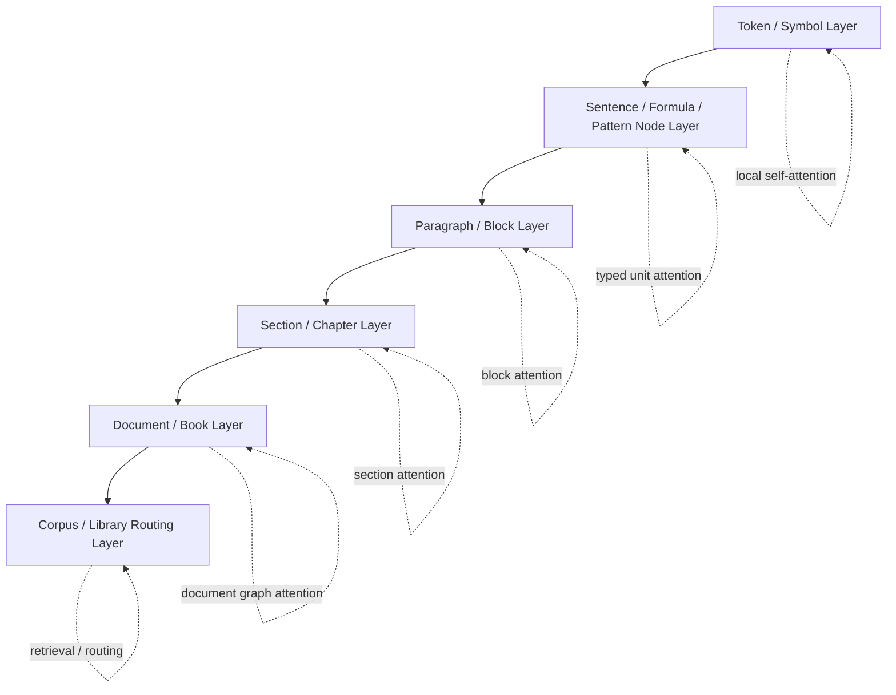

# Meta-Attention Architecture

更新日: 2026-03-28

## 問題設定

通常の Transformer の self-attention は、基本的には token 列上の関係を処理する。

しかし実際に扱いたい関係は、それより上の粒度にも広がる。

- 文と文
- 段落と段落
- 節と節
- 章と章
- 文書と文書
- 書籍と書籍

さらに、

- 引用
- 要約
- 反論
- 定義の継承
- 同一トピックの再出現

のような、上位構造どうしの関係も重要である。

したがって必要なのは、token attention を置き換えることではなく、
`token attention の上に、より大きな意味単位どうしの attention / routing を載せること`
である。

## 結論

自然な設計は、
`多粒度・疎・階層型の meta-attention`
である。

ここで重要なのは、

- 下位では local token attention
- 中位では sentence / paragraph / section attention
- 上位では document / corpus routing

と分けることである。

つまり、すべてを一つの dense attention にしない。

## 全体像

## 1. 各層の役割

### Token / Symbol Layer

対象:

- 自然言語 token
- 数式 token
- regex token
- コード token

役割:

- 局所依存
- 語順
- 演算子結合
- 係り受け候補

ここでは通常の self-attention か、疎 attention で十分である。

### Sentence / Formula / Pattern Node Layer

対象:

- 文
- 節
- 数式
- pattern
- relation bundle

役割:

- 単位ごとの要約表現を作る
- 文どうし、式どうしの関係を見る
- relation slot graph の entry point になる

### Paragraph / Block Layer

対象:

- 段落
- Markdown block
- 表
- code block

役割:

- 文脈のまとまり
- topic の局所遷移
- block 単位の整合

### Section / Chapter Layer

対象:

- 節
- 章

役割:

- 論理展開
- 定義と参照
- 議論の進行
- 長距離依存の圧縮

### Document / Book Layer

対象:

- 文書
- 書籍

役割:

- 全体テーマ
- 章間関係
- 文書全体の stance
- 文書内再参照

### Corpus / Library Routing Layer

対象:

- 複数文書
- 文献集合
- 外部知識部

役割:

- dense attention ではなく retrieval
- citation graph
- semantic neighborhood
- knowledge routing

ここは attention より graph routing に近い。

## 2. なぜ dense な meta-attention にしないのか

章、書籍、コーパスまで全部 self-attention すると、

- 計算量が重い
- ノイズが増える
- 関係が薄いノード同士まで結びつく
- 学習が不安定になる

したがって meta-attention は、

- typed
- sparse
- routed

である方がよい。

## 3. 推奨する attention / routing の種類

### 下位

- local self-attention
- windowed attention
- token to sentence pooling

### 中位

- parent-child cross attention
- sibling sparse attention
- discourse-aware attention

### 上位

- citation / reference graph attention
- section summary attention
- document node routing

### 最上位

- retrieval
- graph traversal
- memory lookup

## 4. hard layer / soft layer との対応

meta-attention も二層表現と対応する。

### hard layer

- 文の所属
- 段落の境界
- 節の親子関係
- 見出し構造
- 参照リンク
- citation relation

### soft layer

- sentence embedding
- paragraph embedding
- section embedding
- document embedding
- cross-unit similarity

つまり、

- hard layer が階層構造を与え
- soft layer が attention の重みや routing を決める

という関係になる。

## 5. 提案方式での meta-attention

この方式では、meta-attention は token self-attention の延長ではなく、
`typed unit attention`
として実装するのが自然である。

例えば次のようにできる。

- sentence node 同士が discourse relation で attention
- section node が paragraph node を要約
- document node が section node から重要情報だけ集約
- corpus layer では top-k document だけを取得

つまり、
`全部を見る`
のではなく、
`適切な粒度のノードだけを見る`
形にする。

## 6. GPT 系では実際どうか

公開情報ベースでは、GPT 系の主流は
`明示的な sentence / paragraph / chapter 階層 attention`
を前面には出していない。

少なくとも公開されている GPT-3 論文では、GPT-3 は GPT-2 と同系統の Transformer であり、
`alternating dense and locally banded sparse attention`
を使うとされている。

OpenAI の open-weight 系である `gpt-oss` でも、公開記事では

- Transformer
- mixture-of-experts
- alternating dense and locally banded sparse attention
- grouped multi-query attention

が明示されているが、文、段落、章ノードの明示的 hierarchical attention は記述されていない。

一方、GPT-4 や GPT-4.1 については、公開されているのは長文性能や長コンテキスト評価であり、正確な attention 機構の詳細は非公開である。

したがって言えるのは、

- GPT 系が長文を扱えても
- 公開情報からは、明示的な多粒度 meta-attention を採用しているとは確認できない

ということである。

## 7. 研究的には何が分かっているか

階層 attention や文書構造を明示的に扱う研究は、かなり存在する。

代表例:

- 文書を階層で処理する [Hi-Transformer](https://aclanthology.org/2021.acl-short.107/)
- multi-document 関係を階層 attention で扱う [Hierarchical Transformers for Multi-Document Summarization](https://aclanthology.org/P19-1500/)
- 長文効率化を狙う [H-Transformer-1D](https://aclanthology.org/2021.acl-long.294/)
- 階層設計が効率的 LM に有利だと主張する [Hierarchical Transformers Are More Efficient Language Models](https://aclanthology.org/2022.findings-naacl.117/)
- 長文モデルが暗黙の文書構造を持つことを調べる [Document Structure in Long Document Transformers](https://aclanthology.org/2024.eacl-long.64/)
- 階層メモリで長文を扱う [HMT](https://aclanthology.org/2025.naacl-long.410/)
- 長文知識 retrieval を木構造で扱う [TreeRAG](https://aclanthology.org/2025.findings-acl.20/)

したがって、meta-attention そのものは突飛ではない。

新規性が出るのは、それを

- 共通IR
- typed slot graph
- hard / soft dual representation
- knowledge routing

と一体化する点にある。

## 8. この方式での勝ち筋

meta-attention が特に効くのは次である。

- 長大な技術文書
- 法務や規格文書
- 教科書や研究書
- 複数文書横断レビュー
- 書籍レベルの要約と比較

理由:

- token 列のフラット処理だけより、上位構造の流れを使える
- retrieval を上位ノード単位で行える
- section や chapter を単位にして知識束縛できる

## 9. 最小実装

最初のプロトタイプなら、次だけで十分である。

1. sentence node を作る
2. paragraph node を作る
3. section node を作る
4. parent-child と sibling 関係を明示する
5. top-k sparse attention か routing を paragraph / section 層で入れる

これだけでも、token-only との差はかなり出る。

## 一文での整理

meta-attention は、token self-attention の全面置換ではなく、sentence / paragraph / section / document / corpus という上位ノードに対する、疎で階層的な typed attention / routing として設計するのが自然である。
