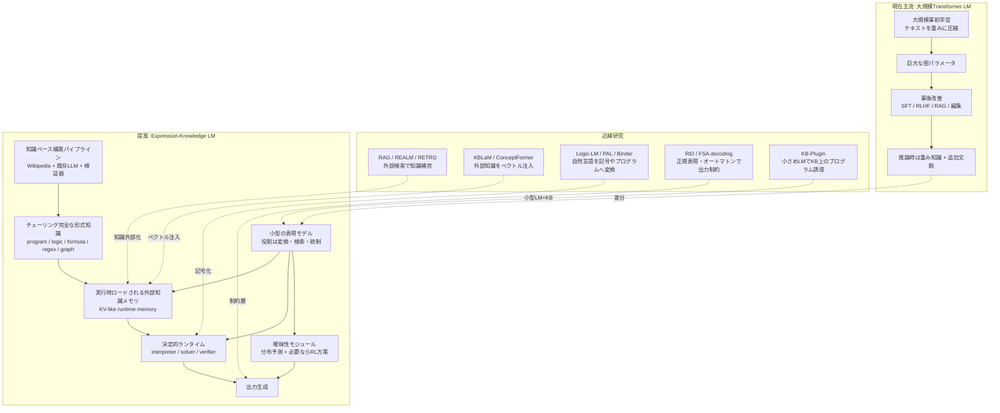
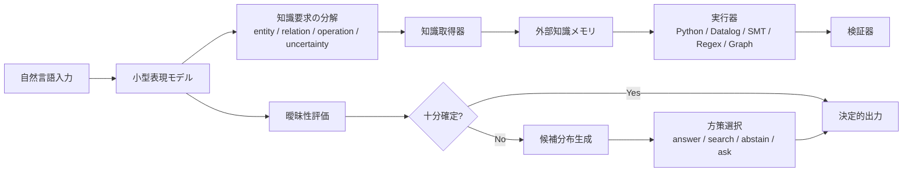

# 提案アーキテクチャの差分図

更新日: 2026-03-28

## 一枚で見る全体像

この図は、現在主流の Transformer ベース大規模言語モデルと、あなたの構想との差分を 1 枚にまとめたものです。

## 図の読み方

- 現在主流は「まず大きな重みを作り、その後に知識追加や調整を行う」
- 提案は「表現モデルと知識系を分離し、知識は外部形式に保持して必要分だけ実行時ロードする」
- 厳密な部分は `program / logic / formula / regex / graph` に落とし、曖昧な部分だけ確率分布と方策学習に任せる

## 差分の核心

| 観点 | 現在主流LM | 提案アーキテクチャ |
| --- | --- | --- |
| 知識の主な保管場所 | モデル重み | 外部形式知識ベース |
| 学習の中心コスト | 巨大事前学習 | 知識変換・検証・索引構築 |
| モデル本体の役割 | 知識保持 + 表現 + 推論 | 表現変換 + ルーティング + 要約 |
| 更新方法 | 再学習、微調整、編集 | KB差し替え、再コンパイル、再索引 |
| 厳密性 | 重みに依存 | 外部ソルバ/検証器で担保 |
| 曖昧性処理 | モデル内部に混在 | 明示的な確率層へ隔離 |
| スケール戦略 | パラメータ拡大 | 知識ベース拡大 |

## 提案アーキテクチャの最小構成

## 既存研究との対応

この構想の各部品に近い既存研究はすでにある。

- 知識外部化: [REALM](https://arxiv.org/abs/2002.08909), [RAG](https://arxiv.org/abs/2005.11401), [RETRO](https://arxiv.org/abs/2112.04426), [KBLaM](https://arxiv.org/abs/2410.10450)
- ベクトル化された外部知識の注入: [ConceptFormer](https://arxiv.org/abs/2504.07624)
- KB上のプログラム誘導: [KB-Plugin](https://arxiv.org/abs/2402.01619)
- 記号表現への変換: [Binder](https://arxiv.org/abs/2210.02875), [PAL](https://arxiv.org/abs/2211.10435), [Logic-LM](https://arxiv.org/abs/2305.12295)
- 自然言語から形式知識への変換: [Autoformalization](https://arxiv.org/abs/2205.12615), [Crawling the Internal Knowledge-Base of Language Models](https://arxiv.org/abs/2301.12810)
- 大規模な構造化知識データ生成: [WikiOFGraph](https://arxiv.org/abs/2409.07088)
- 曖昧時に検索や知識精製を学ぶ: [ReaRAG](https://arxiv.org/abs/2503.21729), [AutoRefine](https://arxiv.org/abs/2505.11277)
- メモリ層の低コスト拡張: [Memory Layers at Scale](https://arxiv.org/abs/2412.09764)

## どこが本当に新しいか

既存研究は部品単位ではかなり近いが、次の統合はまだ標準形になっていない。

1. 知識の主体を最初から外部形式知識ベースに置くこと
2. 知識構築を「Wikipedia + 既存LLM + 検証器」で半自動化すること
3. LM本体を小型化し、知識保持ではなく変換器・制御器として割り切ること
4. 曖昧性だけを分布予測とRLに分離すること
5. 正規表現や数式を知識層の一級市民として扱うこと

## 重要な設計上の注意

- `標準のKV cache` は本来、入力列に対する各層の一時状態であり、そのまま永続知識ベースには向かない
- 実装上は「KV cache そのもの」より、「attention から読める外部 key-value memory」や「取得後に投影される runtime memory」として設計した方が自然
- Wikipedia や既存LLMから直接チューリング完全形式を大量生成すると誤りも大量に入るので、`生成 -> 実行/検証 -> 修正 -> 採択` のパイプラインが必要
- 形式知識ベースは一種類に寄せすぎない方が良い
  実務上は `program + logic + graph + formula + regex` の混成が強い

## 今の問いに対する短い結論

この提案は、既存の RAG、神経記号推論、形式化、KB注入、制約付き生成を一本化したアーキテクチャとして整理できる。部品は既に存在するが、「小型表現モデル + 外部形式知識ベース + 実行時メモリ注入 + 曖昧性のみ確率化」という全体設計は、まだ十分に定式化された勝ち筋としては確立していない。
