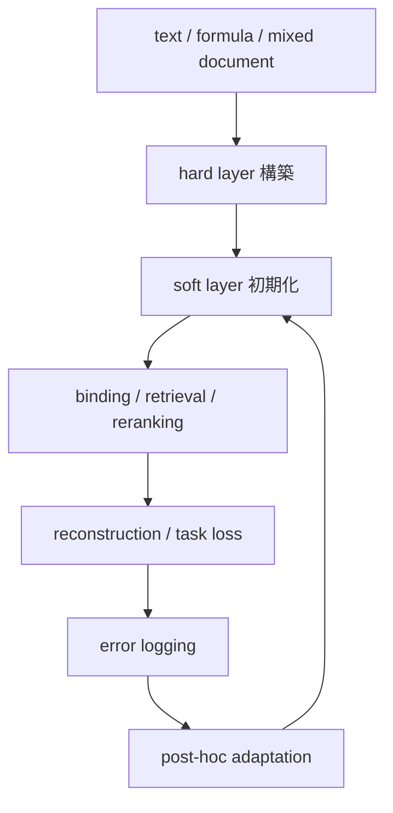

# Soft Layer Learning and Post-Hoc Adaptation

更新日: 2026-03-28

## 問題

Soft Layer は必要だが、これを直接教師ありで作るのは難しい。

理由:

- 潜在表現そのものに正解ラベルはない
- 文脈依存意味は一意ではない
- メタ的関係は注釈が高価
- 全スロット、全関係に dense supervision を付けるのは非現実的

## 結論

Soft Layer は
`直接注釈するもの`
ではなく、
`Hard Layer では取り切れない残差を学習するもの`
と考えるべきである。

さらに、この方式は最初から完成を目指すより、
`事後学習で改善し続ける構造`
にした方が現実的である。

## 基本原理

Soft Layer は少なくとも次を担う。

- 類似用法の近接
- 語義のにじみ
- 未知語の暫定意味
- メタ的関係の残差
- binding の補助

したがって学習目標も、
`何のベクトルにするか`
ではなく、
`何ができるようになるか`
から定めるべきである。

## 学習目標

現実的な目標は次である。

1. 正しい binding 候補が上位に来る
2. 同じ意味や近い用法の slot / relation が近づく
3. 文脈に合わない sense 候補が離れる
4. `text -> hard IR -> text` の再構成が改善する
5. `unresolved` 例で後段の検索や再解釈が改善する

## 直接教師ではなく間接教師を使う

Soft Layer の学習は、間接目的で行うのが自然である。

例:

- contrastive learning
- ranking loss
- reconstruction loss
- retrieval loss
- binding success / failure feedback

つまり、Soft Layer は
`このベクトルが何であるべきか`
ではなく、
`このベクトルがあると何が上手くいくか`
で学ばせる。

## 推奨する学習ループ

## 初期化の方法

最初から Soft Layer をゼロで学習する必要はない。

有力なのは、

- 既存 Transformer の hidden state から蒸留する
- span encoder を使って初期ベクトルを作る
- sentence / paragraph encoder を流用する

ことである。

つまり、
`teacher の連続表現を、小さな sidecar latent space へ圧縮する`
方が自然である。

## 事後学習で何を集めるか

この方式では、実運用で次が集まる。

- binding failure
- wrong sense selection
- unresolved の頻出例
- copy / render failure
- section / document routing miss

これらは、通常の end-to-end LM より問題箇所が局所化されている。

したがって、

- structure assigner
- lexical grounding
- soft layer reranker
- routing policy

を分けて改善しやすい。

## 事後学習の対象

### 更新しやすいもの

- slot embedding projector
- relation embedding projector
- binding scorer
- reranker
- copy / render policy

### 更新不要にしやすいもの

- 既存KB
- deterministic parser
- 数式処理器
- regex 処理器

ここが通常の巨大LMよりかなり有利な点である。

## 何が嬉しいか

事後学習を前提にすると、次が成立しやすい。

- 新しい固有名詞への適応
- 分野特化
- 文書構造ごとの補正
- ユーザー組織内の用語癖の吸収
- 失敗例からの局所改善

つまり、最初から万能モデルを作るのではなく、
`運用で改善できる小型構造系`
にできる。

## 最小実装

最小プロトタイプでは、次の4つで十分である。

1. hard layer を先に作る
2. slot と relation に small embedding を付ける
3. binding ranking loss をかける
4. unresolved / wrong binding 例で後から再学習する

## 一文での整理

Soft Layer は直接注釈する対象ではなく、Hard Layer の残差として、binding、retrieval、reconstruction の成功率を上げるように学習し、事後学習で継続改善する層として設計するのが自然である。
