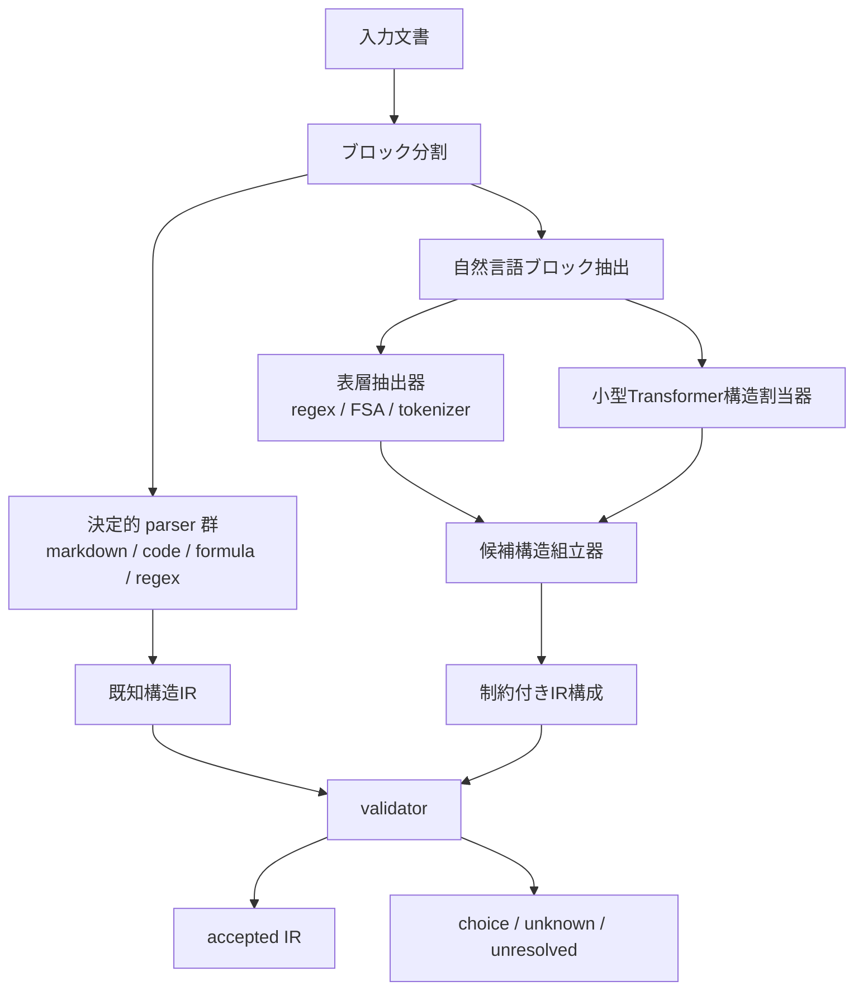

# 構造割当器アーキテクチャ

更新日: 2026-03-28

## 目的

この文書の目的は、入力文章や混在文書を、定義済みの共通IR構造へどのように割り当てるかを整理することである。

問題は単純ではない。

- 文法を定義するだけでは、入力はその構造に自動では入らない
- 自然言語は曖昧で、省略や言い換えが多い
- Markdown、数式、コードは比較的決定的に parse できる

したがって、最適なのは「全部を Transformer に任せる」ことでも、「全部をルールで処理する」ことでもない。

## 結論

構造割当器は、`決定的 parser + regex/FSA + 小型Transformer + validator` のハイブリッドにするのが最も自然である。

Transformer はモデル全体の中核ではなく、

`曖昧な自然言語を、候補IR構造へ写像する専門部品`

として使う。

## 全体像

## 1. ブロック分割

最初に行うべきは、文書全体を一枚のテキストとして扱わないことだ。

先にブロック単位へ分ける。

対象:

- Markdown 見出し
- 段落
- 箇条書き
- 表
- インラインコード
- fenced code block
- 数式ブロック

この段階は、ほぼ決定的に処理できる。

## 2. 決定的 parser 群

自然言語以外は、できる限り決定的 parser を優先する。

### Markdown

- Markdown parser
- ブロック構造
- inline 構造

### コード

- Python AST
- TypeScript AST
- Rust AST

### 数式

- 数式 parser
- LaTeX parser
- 数式 token parser

### 正規表現

- regex parser
- FSA compiler

ここは Transformer より deterministic parser の方が強い。

## 3. 表層抽出器

自然言語ブロックに対しては、まず cheap な抽出を行う。

対象:

- 助詞
- 句読点
- 数字
- 単位
- 記号
- 既知表現
- 定型句
- 括弧境界

手段:

- regex
- FSA
- 辞書
- 簡易 tokenizer

ここで文の骨格候補を先に取る。

## 4. 小型Transformer構造割当器

ここが自然言語処理の中心になる。

役割:

- span の境界推定
- role 推定
- 述語項構造推定
- 匿名スロット割当
- 曖昧候補の列挙
- 候補構造のスコアリング

重要なのは、Transformer に「最終文字列生成」をさせることではなく、「構造候補の推定器」にすることだ。

## 5. 構造割当器が予測するもの

予測対象は、自由なテキストではなく、限定された構造情報に絞る。

たとえば:

- 述語位置
- argument span
- role
- quantity span
- unit span
- reference candidate
- choice candidate
- confidence

つまり、`text -> full IR text generation` より、

- `text -> labeled spans`
- `text -> candidate edges`
- `text -> slot assignments`

に寄せた方がよい。

## 6. なぜ seq2seq 全生成より良いか

IR 全体を Transformer に直接生成させる方式もあるが、初期設計としては不利である。

理由:

- 文法を壊しやすい
- 括弧や構造 token の生成コストが無駄
- 検証前提になる
- 誤り位置が分かりにくい
- 小型化しにくい

一方、構造割当器方式なら、

- 出力空間が小さい
- 検証しやすい
- 学習データを少なくできる
- 未知語に強い

## 7. 制約付きIR構成

Transformer の出力を、そのまま最終IRにしないことが重要である。

代わりに、

- 文法制約
- タグ制約
- role 制約
- 型制約
- 単位制約
- 既知 dependency

の下で IR を組み立てる。

つまり Transformer は「候補提案」、最終構成は「制約付き組立」である。

## 8. validator

構成後は必ず validator を通す。

検査対象:

- tag の妥当性
- role の妥当性
- 括弧構造
- quantity と unit の整合性
- formula の整合性
- pattern の妥当性
- ref の存在

通らなければ、

- 自動修正
- `unresolved`
- `choice`
- reject

のいずれかに落とす。

## 9. unknown と choice を前提にする

この仕組みで最も重要な設計思想の一つは、失敗を許容することだ。

すべてを一意に解釈しようとしない。

保持すべきもの:

- `unknown`
- `choice`
- `alt`
- `conf`
- `unresolved`

これにより、構造割当器は「分からない」を表現できる。

## 10. 入力タイプごとの最適処理

### Markdown

- 主処理: 決定的 parser
- Transformer は補助

### コード

- 主処理: 言語 parser
- Transformer はコメントや docstring 解釈のみ補助

### 数式

- 主処理: 数式 parser
- Transformer は自然文との対応付けのみ補助

### 自然言語

- 主処理: 小型Transformer構造割当器
- regex/FSA と validator が補助

## 11. 最小モデル構成

最初のプロトタイプで必要なのは次の4つで十分である。

### 1. deterministic front-end

- markdown parser
- formula parser
- regex parser
- code parser

### 2. surface analyzer

- tokenizer
- regex extractor
- FSA-based marker detector

### 3. structure assigner

- 小型 Transformer
- span labeling
- role prediction
- slot assignment

### 4. IR builder + validator

- grammar-aware constructor
- type / tag validator
- unresolved fallback

## 12. Transformer は必要か

結論としては、必要である。ただし役割は限定するべきである。

Transformer が必要な理由:

- 自然言語の曖昧性
- 省略
- 言い換え
- 文脈依存
- 未知語処理

Transformer を限定すべき理由:

- deterministic に解ける部分は deterministic に処理した方が安い
- 全部生成モデルにすると、また「重い言語モデル」に戻る
- 構造割当だけなら小型で済む

## 13. Transformer型LMとの違い

通常の Transformer 型LM:

- text を入力
- 次トークン予測
- 必要ならそのまま答えを生成

この構造割当器:

- text を入力
- 構造候補を推定
- 制約下で IR に組み立て
- 未解決を保持
- 必要なら後段へ渡す

つまり、予測対象が「次トークン」ではなく「意味構造候補」である。

## 14. 一文での定義

この構造割当器アーキテクチャは、

`決定的に parse できる部分は parser と regex/FSA で処理し、曖昧な自然言語部分だけを小型Transformerで構造候補へ写し、それを制約下で共通IRに組み立てるためのハイブリッド設計`

である。
