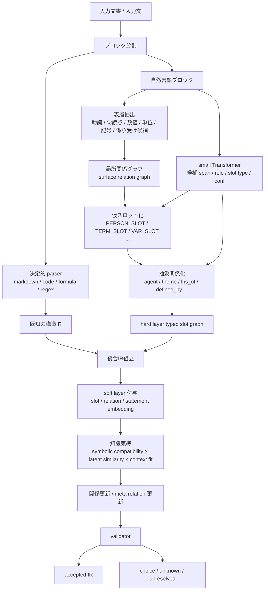

# Structure Assignment Pipeline

更新日: 2026-03-28

## 結論

関係抽出とスロット化は、どちらかを先に一度だけやるものではない。

自然な流れは、

1. 生の入力から表層関係を取る
2. 型付きの仮スロットを作る
3. スロット間の抽象関係を作る
4. 知識束縛で関係を再評価する

という段階的な反復である。

## 全体像

## 1. 表層関係を先に取る理由

スロット化前には、生の表記に依存する重要な手がかりがある。

例:

- 日本語の助詞
- 句読点
- 括弧
- 語順
- 数式の演算子結合
- regex の構造記号

これらは、抽象化の前に拾った方が情報が落ちにくい。

したがって最初に取るべきなのは、
`完全な意味関係`
ではなく、
`局所的で表層に近い関係`
である。

## 2. 仮スロット化

次に、内容依存の語や記号を型付きで匿名化する。

例:

- `太郎` -> `PERSON_SLOT_1`
- `新型量子加速器` -> `TERM_SLOT_1`
- `x` -> `VAR_SLOT_1`
- `L` -> `FUNC_SLOT_1` または `TERM_SLOT_2`

ここで重要なのは、単に置き換えるのではなく、

- 元の表記
- 出現位置
- 局所関係
- 型候補
- 信頼度

を持った `仮スロット` にすることである。

## 3. スロット後に抽象関係を作る

仮スロット化の後で、より意味寄りの関係を張る。

例:

- `agent`
- `theme`
- `recipient`
- `lhs_of`
- `rhs_of`
- `coefficient_of`
- `defined_by`
- `instance_of`

この段階では、
`語と語の関係`
よりも
`型付きノード同士の関係`
へ寄せる。

これにより、知識部への接続や rule lookup がしやすくなる。

## 4. 束縛後に再更新する

知識部との束縛が入ると、解釈は変わる。

例:

- `L` が loss function だと分かる
- `bank` が金融機関だと分かる
- `はし` が bridge だと分かる

このとき必要なのは、ノードだけでなく関係も更新することだ。

更新対象:

- role の再評価
- relation label の再評価
- candidate sense の絞り込み
- meta relation の追加
- confidence の更新

つまり束縛は、最後の付け足しではなく、
`関係グラフの再解釈ステップ`
である。

## 5. 先に全部スロット化しない理由

入力直後にすべてをスロット化すると、次が落ちやすい。

- 助詞の差
- 語順手がかり
- 表記の違い
- 近接共起
- 文字種情報

したがって、
`生テキスト -> 全匿名化 -> 関係推定`
は不利である。

## 6. 先に全部関係確定しない理由

逆に、束縛前に意味関係を全部確定しようとしても無理がある。

理由:

- 語義がまだ未解決
- 専門語の型がまだ曖昧
- 文脈依存の役割がまだ揺れる

したがって、
`完全な関係確定 -> 後から知識接続`
も不利である。

## 7. 最も自然な設計

最も自然なのは、

`粗い表層関係抽出 -> 仮スロット化 -> 抽象関係化 -> 束縛 -> 関係再更新`

の反復である。

これは一種の coarse-to-fine であり、

- 先に安い情報を使う
- 後から高い情報で解釈を締める

という流れになっている。

## 8. hard layer / soft layer との対応

このパイプラインは二層表現と対応している。

### hard layer に入るもの

- typed slot
- relation label
- statement structure
- formula structure
- pattern structure
- unresolved / choice

### soft layer に入るもの

- slot embedding
- relation embedding
- statement embedding
- context fit
- latent similarity

つまり、

- 初期段階では hard layer の粗い骨格を作る
- 後段で soft layer を使って束縛と再評価を行う

という役割分担になる。

## 9. 最小実装

最小プロトタイプなら、次だけでよい。

1. 係り受けや表層手がかりから局所関係候補を出す
2. span ごとに typed temporary slot を付ける
3. slot 間に少数の抽象関係を張る
4. 知識束縛で relation score を更新する
5. 解決不能なら `unresolved` で止める

## 一文での整理

この方式では、関係抽出はスロット化の前にも後にも存在する。

前者は `表層的・局所的関係`、後者は `抽象的・知識接続向き関係` であり、知識束縛後にもう一度更新される。
