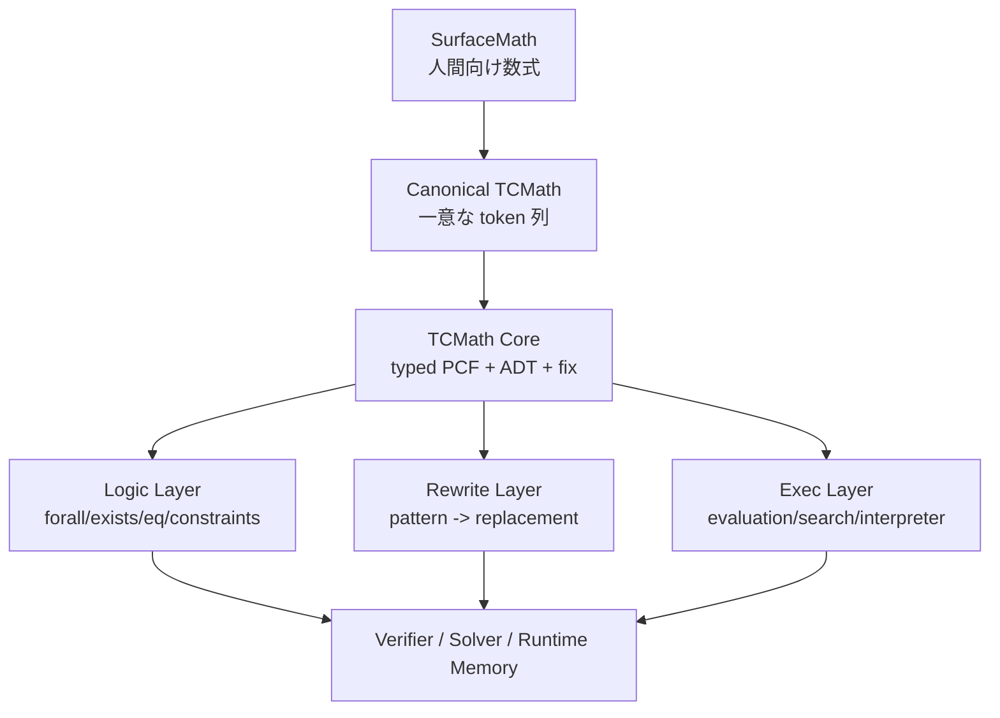

# TCMath/1 設計案

更新日: 2026-03-28

## 要約

目的は、「数式を token 化できて、機械実行できて、Turing 完全な形で表現できる知識表現」を作ることです。

結論として、数式そのものを直接 Turing 完全にするのではなく、

1. 人間向けの数式表現
2. 一意な token 列に変換できる canonical 表現
3. Turing 完全な最小実行コア
4. その上に載る論理・書換え・定理・制約層

の4層に分けて設計するのが自然です。

この設計では、数式は `TCMath Core` という最小言語に埋め込まれます。`TCMath Core` は `PCF` に近いコアで、`lambda`, `application`, `if`, `match`, `fix` を持つため Turing 完全です。数式、論理式、書換え規則、定義、証明、実行手順はすべてこのコア上に乗ります。

## 1. 目的

この言語に求める要件は次の通りです。

- 数式を曖昧なく token 化できる
- 機械が構文解析しやすい
- 知識ベースとして保存しやすい
- 必要部分だけ runtime memory にロードしやすい
- 厳密な部分は決定的に実行・検証できる
- 曖昧な部分は別モジュールへ切り出せる
- 実行層は Turing 完全である

## 2. 設計原則

### 2.1 数式と実行を分ける

数式はしばしば宣言的です。一方、Turing 完全性は反復・再帰・条件分岐・無限計算可能性から来ます。

したがって設計は次の二層に分けます。

- 宣言層:
  数式、等式、制約、定理、書換え規則
- 実行層:
  再帰、条件分岐、パターンマッチ、計算、探索

### 2.2 infix を捨てて canonical prefix にする

人間向けには infix や LaTeX 風記法が便利ですが、保存形式としては曖昧です。優先順位や括弧の省略があるからです。

そのため保存形式は S-expression 風の prefix 表現に統一します。これにより次が得られます。

- 一意な構文木
- token 境界が明確
- subtree 単位で切り出せる
- parser が簡単
- retrieval 用の chunk 化がしやすい

### 2.3 純粋な論理部分と Turing 完全部分を分ける

証明や検証では、何でも計算できる unrestricted recursion は扱いにくいです。よって mode を2つ持たせます。

- `safe`:
  検証・簡約・定理・等式変形用。原則 total subset
- `exec`:
  `fix` を許可する Turing 完全 subset

これにより、知識ベース全体は厳密性を保ちつつ、必要な場所だけ完全計算能力を持てます。

## 3. レイヤ構造



## 4. コア言語の選択

`TCMath Core` は、次の最小要素を持つ typed PCF 系にします。

- `lam`
- `app`
- `let`
- `if`
- `match`
- `fix`
- algebraic data types
- exact integers / rationals
- symbolic atoms

これで十分です。理由は、`PCF + fix` が計算可能関数を表現できるためです。つまり、Turing machine、register machine、while program を encode できます。

## 5. トークン体系

### 5.1 トークン種別

保存形式の token は次の5種に分けます。

- 構造 token
- keyword token
- operator token
- atom token
- metadata token

### 5.2 構造 token

```text
( )
[ ]
{ }
```

最低限 `(` `)` だけでもよいですが、配列や binder を読みやすくするため `[]` も許可します。

### 5.3 keyword token

```text
module import data ctor def let lam app if match fix
safe exec theorem axiom lemma rule fact query eval check
forall exists and or not implies iff
type where proof assume
```

### 5.4 operator token

```text
add sub mul div pow neg
eq neq lt le gt ge
sum prod integral deriv limit
compose map fold filter
pair fst snd cons nil
```

重要なのは、演算子を記号そのものではなく意味トークンで持つことです。`+` より `add` の方が tokenizer と parser の両方に優しいです。

### 5.5 atom token

atom は prefix を付けて lexical ambiguity をなくします。

```text
var:x
sym:mass
mod:physics.kinematics
ty:Nat
ty:Int
ty:Rat
ty:Bool
ty:Expr
i:42
i:-7
q:22/7
s:"hello"
```

必要なら storage 時に `sym:mass` を `sid:000123` のような symbol id に圧縮できます。

## 6. 構文

### 6.1 top-level

```lisp
(module mod:algebra.core
  <decl>*)
```

### 6.2 宣言

```lisp
(data <TypeName> [<CtorDecl>+])
(def <name> <type> <term>)
(safe <name> <type> <term>)
(exec <name> <type> <term>)
(rule <name> <pattern> <replacement>)
(axiom <name> <formula>)
(theorem <name> <formula> <proof-term>)
(fact <name> <formula>)
(query <formula>)
(eval <term>)
(check <term>)
```

### 6.3 項

```lisp
<term> ::=
  <atom>
| (lam [<binder>+] <term>)
| (app <term> <term>+)
| (let [[<name> <term>]+] <term>)
| (if <term> <term> <term>)
| (match <term> [<pattern> <term>]+)
| (fix <name> <term>)
| (quote <term>)
| (splice <term>)
| (add <term> <term>)
| (mul <term> <term>)
| ...
```

### 6.4 論理式

```lisp
<formula> ::=
  (eq <term> <term>)
| (lt <term> <term>)
| (le <term> <term>)
| (and <formula>+)
| (or <formula>+)
| (not <formula>)
| (implies <formula> <formula>)
| (forall [[<name> <type>]+] <formula>)
| (exists [[<name> <type>]+] <formula>)
```

## 7. 型体系

最初の設計では、次の型があれば十分です。

```text
Bool
Nat
Int
Rat
String
Symbol
Expr
Formula
List[T]
Pair[A B]
Arrow[A B]
```

将来的には `Tensor`, `Matrix`, `Set`, `Measure`, `Graph`, `Regex` を追加できます。

### 7.1 なぜ `Expr` を持つか

数式処理では、「式そのもの」をデータとして扱う必要があります。たとえば微分、展開、因数分解、置換、変形です。

そのため、

- `Int` は値
- `Expr` は式木

を分けます。

例:

```lisp
(add i:2 i:3)
```

KaTeX:

$$
2 + 3
$$

は即値計算できる項ですが、

```lisp
(quote (add var:x i:3))
```

KaTeX:

$$
x + 3
$$

は式木データです。

## 8. Turing 完全性

### 8.1 必要十分な最小要素

次を持てばよいです。

- first-class function
- unbounded data
- conditional branching
- recursion via `fix`

`TCMath Core` はこの条件を満たします。

### 8.2 直感的な説明

`fix` により自己再帰関数を書けます。`if` と `match` により分岐できます。`Nat`, `List`, `Pair` で無限に大きい状態を表せます。従って、while program や register machine を encode できます。

### 8.3 明示的な立場

純粋な数式層だけを見ると Turing 完全ではありません。Turing 完全なのは、数式を宿す `TCMath Core` です。

この分離は意図的です。数式知識と計算能力を分離したいからです。

## 9. canonical form

人間向け表現と保存表現は分けます。

### 9.1 authoring form

```lisp
(def square (-> Int Int)
  (lam [var:x ty:Int]
    (mul var:x var:x)))
```

KaTeX:

$$
\mathrm{square}(x) = x^2
$$

### 9.2 storage form

保存時には binder を安定化させます。最初の版では `var:x` を残してよいですが、最終的には de Bruijn index に落とす方が安全です。

例:

```lisp
(def sym:square (Arrow ty:Int ty:Int)
  (lam [ty:Int]
    (mul (var 0) (var 0))))
```

これにより、alpha-renaming の揺れが消えます。

## 10. 例

### 10.1 多項式

```lisp
(def sym:poly1 ty:Expr
  (quote
    (add
      (mul i:3 (pow var:x i:2))
      (add (mul i:2 var:x) i:1))))
```

KaTeX:

$$
3x^2 + 2x + 1
$$

### 10.2 階乗

```lisp
(exec sym:fact (Arrow ty:Nat ty:Nat)
  (fix sym:fact
    (lam [var:n ty:Nat]
      (if (eq var:n i:0)
          i:1
          (mul var:n
               (app sym:fact (sub var:n i:1)))))))
```

KaTeX:

$$
\mathrm{fact}(n) =
\begin{cases}
1 & (n = 0) \\
n \cdot \mathrm{fact}(n-1) & (n > 0)
\end{cases}
$$

### 10.3 微分規則

```lisp
(rule sym:deriv-sum
  (app sym:deriv (quote (add ?a ?b)) ?x)
  (quote
    (add
      (app sym:deriv ?a ?x)
      (app sym:deriv ?b ?x))))
```

KaTeX:

$$
\frac{d}{dx}(a + b) = \frac{da}{dx} + \frac{db}{dx}
$$

### 10.4 物理法則

```lisp
(fact sym:newton-2
  (forall [[var:m ty:Rat] [var:a ty:Rat] [var:f ty:Rat]]
    (implies
      (eq var:f (mul var:m var:a))
      (eq var:a (div var:f var:m)))))
```

KaTeX:

$$
f = ma \Rightarrow a = \frac{f}{m}
$$

### 10.5 Turing 完全性の最小例

チューリング機械そのものを直接持つ必要はありません。`fix` を使って遷移関数を反復すればよいです。

```lisp
(exec sym:run (Arrow ty:State ty:State)
  (fix sym:step
    (lam [var:s ty:State]
      (if (app sym:halt? var:s)
          var:s
          (app sym:step (app sym:delta var:s))))))
```

KaTeX:

$$
\mathrm{run}(s) =
\begin{cases}
s & \mathrm{halt?}(s) \\
\mathrm{run}(\delta(s)) & \text{otherwise}
\end{cases}
$$

ここで `State` と `delta` を適切に定義すれば、任意の register machine を表現できます。

## 11. 知識ベースへの格納単位

`TCMath` の知識単位は declaration 単位にします。

格納の基本粒度:

- 1 declaration = 1 primary chunk
- 大きい term は subtree ごとに secondary chunk

各 chunk は次の情報を持ちます。

- canonical token sequence
- AST hash
- free symbol set
- type signature
- dependency list
- verification status
- provenance

これにより、runtime memory に必要な部分だけロードできます。

## 12. Wikipedia + 既存LLM からの構築パイプライン

ユーザーの発想を反映すると、知識ベース構築は次の段階になります。


### 12.1 重要な方針

- 既存LLMは knowledge author ではなく candidate generator として使う
- 採択条件は parser 通過だけでは足りない
- `type check`, `execution test`, `symbolic consistency`, `cross-source agreement` が必要

## 13. 実行モデル

推論時は次の順です。

1. 表現モデルが query を TCMath query に落とす
2. retrieval が関連 declaration を引く
3. runtime memory に対象 chunk をロードする
4. executor が `safe` を優先して評価する
5. 不足時のみ `exec` や外部 solver を使う
6. 出力を自然言語へ戻す

## 14. この設計の利点

- 保存形式が一意
- parser が簡単
- Turing 完全性が明確
- 数式処理と一般計算を同じ器で扱える
- total subset と partial subset を分けられる
- token 列として学習・検索・圧縮しやすい
- knowledge base の chunk 化に向く

## 15. この設計の弱点

- 生成器が間違った TCMath を出す可能性が高い
- `Expr` と値の区別をモデルが学ぶ必要がある
- unrestricted `fix` は検証を難しくする
- 数学の自然言語から完全な formalization を得るのは依然難しい

## 16. 最初の実装範囲

最初のプロトタイプでは、次だけで十分です。

### 16.1 型

```text
Bool Nat Int Rat Expr Formula List Pair Arrow
```

### 16.2 term

```text
lam app let if match fix quote
add sub mul div pow eq lt le
cons nil pair fst snd
```

### 16.3 top-level

```text
module def safe exec rule fact query eval check
```

これで、

- 算術
- 多項式
- 初等代数
- 基本的な微積の書換え
- 単位変換
- 単純な物理法則
- 再帰計算

までは扱えます。

## 17. 今回の設計判断

この提案では、`数式モデル = TCMath Core 上に載る数式知識表現` と定義します。

つまり、

- 数式は `Expr` として表現される
- 数式規則は `rule` や `fact` として表現される
- 計算は `exec` として表現される
- それら全体を支える `Core` が Turing 完全

です。

これが、数式を token 化し、知識ベースに保存し、必要時だけ runtime memory に入れ、なおかつ計算可能性を失わない最小設計です。
