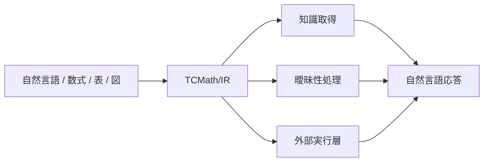
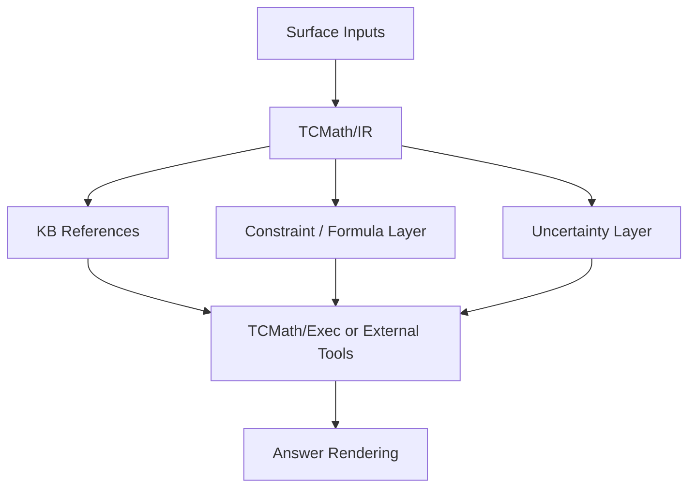

# TCMath/IR 設計案

更新日: 2026-03-28

## 重要な再定義

この文書では、`TCMath` を「数式を実行するための言語」ではなく、

- すべてのLMが共有できる
- 曖昧さを明示できる
- 自然言語、数式、論理、知識参照を同じ形式で表せる
- token 化しやすく、保存しやすく、検索しやすい

という意味表現レイヤーとして定義する。

したがって、`TCMath` の主目的は Turing 完全な実行そのものではない。主目的は `共通理解のための canonical interlingua` を与えることにある。

## 一言でいうと何か

`TCMath` は、

- 自然言語
- 数式
- 関係知識
- 制約
- 曖昧性
- 推論要求

を、LM非依存の共通表現に落とすための `semantic IR` である。

位置づけとしては、

- AMR より数式・制約・知識参照に強く
- 論理式より自然言語に近く
- RAG の text chunk より構造化され
- proof assistant より軽く
- 実行言語より理解共有を優先する

ような中間層を狙う。

## 1. 何が前回と違うか

前回の設計は `TCMath Core = typed PCF + fix` を中心に置いていた。これは execution substrate としては有効だが、`すべてのLMで理解できる共通言語処理レイヤー` という意図には合っていない。

この意図に合わせるなら、中心は次のように変わる。

- 以前:
  `TCMath = 実行可能な数式言語`
- 修正版:
  `TCMath = LM共通の意味表現`

そして Turing 完全性は `TCMath` 自身の必須条件ではなく、

- `TCMath/IR`:
  共通意味表現
- `TCMath/Exec`:
  必要なときだけ参照される実行層

に分離するのが自然である。

## 2. 設計目標

`TCMath/IR` に必要なのは次の性質である。

- LM非依存
- token 境界が明確
- syntax が単純
- semantic role が明示的
- canonical 化できる
- 曖昧性を明示できる
- 数式も自然文も同じ器に載せられる
- 知識ベース参照を埋め込める
- 実行層への橋渡しができる

逆に、最初から不要なものは次である。

- 任意再帰をコア文法に埋め込むこと
- proof assistant 並みの厳密さ
- 人間向けの美しい表記

## 3. TCMath/IR の役割

`TCMath/IR` は次の変換の中間点として使う。



LM に期待するのは、

- 入力を `TCMath/IR` に変換する
- `TCMath/IR` から出力を再生成する
- 足りない参照先を選ぶ
- 曖昧な箇所を候補化する

ことであり、知識そのものの保持ではない。

## 4. 基本原則

### 4.1 小さい固定語彙

`TCMath/IR` は、小さく固定された語彙で書ける必要がある。すべてのLMで理解可能にしたいなら、open-ended な構文より closed ontology の方がよい。

中核 token 例:

```text
doc stmt assert ask define refer entity event relation
arg role value quantity unit time place cause condition
eq neq lt le gt ge add sub mul div pow
and or not implies
alt conf unknown unresolved
ref kb proc rule theorem
```

### 4.2 prefix と role 明示

infix や省略構文は避ける。各ノードは「何であるか」を token で先頭明示する。

例:

```text
(assert
  (eq
    (quantity force)
    (mul (quantity mass) (quantity acceleration))))
```

### 4.3 述語より role

LM間共有を考えると、語順依存ではなく role を明示した方がよい。

例:

```text
(event
  (pred give)
  (arg giver ent:john)
  (arg receiver ent:mary)
  (arg item ent:apple)
  (arg count num:3)
  (time past:yesterday))
```

### 4.4 曖昧性を隠さない

自然言語理解では曖昧さを消すより、明示的に持つ方が強い。

例:

```text
(refer
  (surface "bank")
  (alt (sense finance.bank) conf:0.62)
  (alt (sense geography.river_bank) conf:0.38))
```

### 4.5 実行は参照でぶら下げる

コアIRを複雑にしないため、手続き的意味は参照ノードで外出しする。

例:

```text
(define
  (symbol force_from_mass_and_acceleration)
  (ref proc:physics.newton2.compute_force))
```

これにより `IR` は単純なまま保てる。

## 5. レイヤ構造



意味としては、

- `TCMath/IR`:
  共通理解
- `Constraint / Formula Layer`:
  数式・論理・制約
- `TCMath/Exec`:
  必要時のみ使う実行層

である。

## 6. 構文方針

保存形式は S-expression 風でよい。理由は単純で、全LMにとって parse しやすいからである。

最小構文は次で十分。

```lisp
<node> ::= <atom>
         | (<tag> <field>*)

<field> ::= <node>
          | (<role> <node>)
```

重要なのは、文法の複雑さではなく tag と role の安定性である。

## 7. 最小タグ集合

最初の版では次で足りる。

### 7.1 文書・発話

```text
doc
stmt
assert
ask
define
refer
```

### 7.2 意味単位

```text
entity
event
relation
quantity
formula
constraint
```

### 7.3 役割

```text
pred
arg
role
value
unit
time
place
cause
condition
```

### 7.4 演算

```text
eq neq lt le gt ge
add sub mul div pow
and or not implies
```

### 7.5 メタ

```text
ref
kb
proc
alt
conf
unknown
unresolved
```

## 8. 数式はどう入るか

ここでの数式は、`TCMath` の全部ではなく、一部のサブツリーである。

例:

```lisp
(stmt
  (assert
    (eq
      (quantity sym:force unit:newton)
      (mul
        (quantity sym:mass unit:kg)
        (quantity sym:acceleration unit:m_per_s2)))))
```

$$
F = ma
$$

つまり、数式は `TCMath/IR` の中の `formula / quantity / operator` ノードとして表現される。

## 9. 自然言語はどう入るか

数学以外の文も表せなければ、共通言語処理レイヤーにはならない。

例:

```lisp
(stmt
  (assert
    (event
      (pred give)
      (arg giver ent:john)
      (arg receiver ent:mary)
      (arg item ent:apple)
      (arg count num:3)
      (time past:yesterday))))
```

これは次の自然文に対応する。

$$
\text{John gave Mary three apples yesterday.}
$$

## 10. 曖昧性はどう入るか

例:

```lisp
(stmt
  (refer
    (surface s:"bank")
    (alt (entity sense:finance.bank) conf:0.62)
    (alt (entity sense:geography.river_bank) conf:0.38)))
```

このようにすれば、モデルは一つに潰さず候補分布を保持できる。

## 11. 知識参照はどう入るか

`TCMath/IR` 自体は知識の全文を埋め込まない。代わりに、参照ノードを持つ。

例:

```lisp
(stmt
  (ask
    (relation
      (pred compute)
      (arg target sym:force)
      (arg via (ref kb:physics.newton2)))))
```

あるいは、外部計算への接続はこう持てる。

```lisp
(stmt
  (ask
    (ref proc:physics.newton2.compute_force)))
```

これにより `IR` は理解レイヤーに集中できる。

## 12. Turing 完全性はどこに置くべきか

ここが重要である。

ユーザーの意図に従うなら、Turing 完全性は `TCMath/IR` の本体に置かない方がよい。

理由:

- すべてのLMで理解しやすい形にしたい
- parsing と canonicalization を簡単にしたい
- 意味共有層と手続き層を分けたい
- 実行可能性は必要でも、常に全面に出す必要はない

したがって設計はこうなる。

- `TCMath/IR`:
  非Turing完全でもよい。意味共有が目的
- `TCMath/Exec`:
  必要なら Turing 完全。IR から `ref proc:*` で参照

つまり、「Turing 完全な形で表現可能」にしたいなら、

- `TCMath/IR` が `TCMath/Exec` を指せる

で十分である。

## 13. 類似研究との違い

| 類似物 | 近い点 | TCMath/IR の違い |
| --- | --- | --- |
| AMR | 文意味の graph 表現 | 数式、制約、知識参照、曖昧性を最初から一級市民にする |
| UCCA / SRL | 役割ベースの意味表現 | KB参照と計算参照まで含める |
| 論理式 | 厳密 | 自然言語の event / entity / refer を軽く保てる |
| RAG chunk | 外部知識を参照する | text ではなく canonical semantic node で参照する |
| PAL / Logic-LM | 記号表現へ写像する | 一回限りの推論用ではなく、全LM共通の持続的中間表現を狙う |
| Lean / Coq | 厳密な形式化 | proof assistant ではなく interlingua である |

## 14. この設計の利点

- すべてのLMで読みやすい
- tokenizer に優しい
- retrieval 単位を安定化できる
- 数式も自然文も同じ器で表せる
- 曖昧性を隠さない
- 実行層を差し替えやすい
- KBとLMの分離に向く

## 15. この設計の弱点

- ontology 設計が難しい
- 過度に一般化すると表現が冗長になる
- 自然言語から完全に lossless ではない
- LM が tag/role を安定生成できるように訓練が要る
- proof assistant ほどの厳密さは最初から持たない

## 16. 今の定義での短い結論

あなたの意図に沿うなら、`TCMath` は「数式DSL」でも「実行言語」でもなく、`全LMが共有できる意味表現レイヤー` と定義すべきである。

数式はその中の一部分であり、Turing 完全性はコアに埋め込むより、必要に応じて下位の `Exec` 層へ委譲する方がよい。

この再定義にすると、`TCMath` は類似研究の中では、AMR や semantic parsing に近いが、数式・制約・知識参照・外部実行参照を強く統合した interlingua という位置づけになる。
