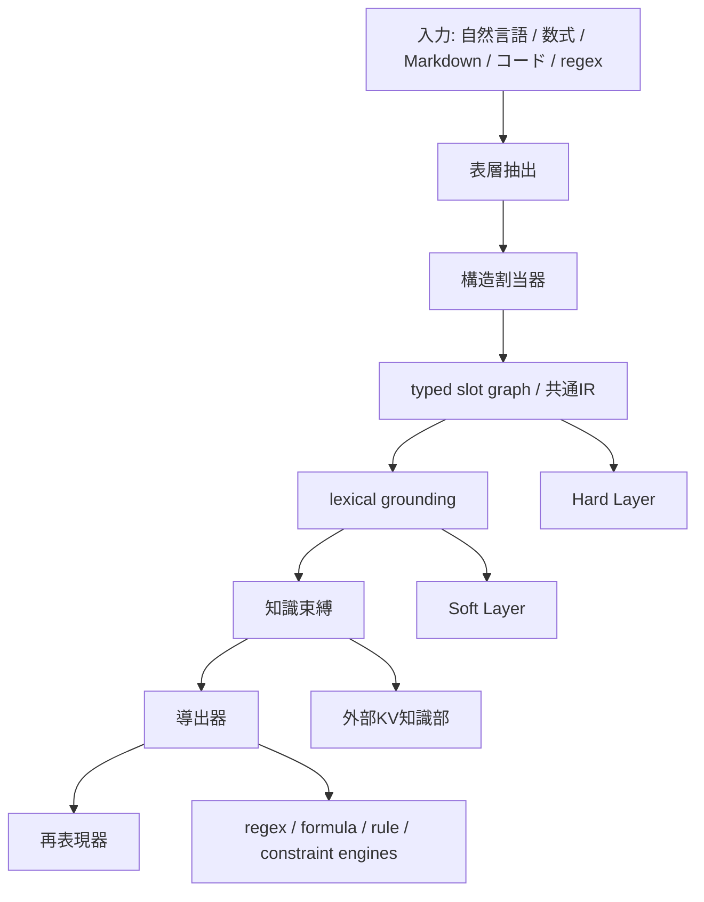

# 表現・知識分離言語モデル 研究計画

更新日: 2026-03-28

## 1. 研究の題目

表現部、知識部、導出部を分離し、共通IR、スロット化、語彙接地、外部KV知識ベース、軽量導出器を組み合わせることで、低コストかつ解釈可能な言語モデルを実現する研究。

## 2. 研究の目的

本研究の目的は、Transformer 系大規模言語モデルが抱える次の問題に対して、代替原理を与えることである。

- 知識、構造、推論方針が重みに絡み合っている
- 学習コストと更新コストが高い
- どの知識に依拠したか追跡しにくい
- 長大文書や混在文書を token 列だけで扱うのが非効率である
- 数式、正規表現、構造制約を扱うのに無駄が多い

目標は、汎用会話モデルを全面置換することではない。

目標は、

- 構造性が高い
- 知識更新が多い
- 監査性が重要
- 少パラメータと速度が重要

な領域で、既存の GPT 型より有利なモデル系を作ることである。

## 3. 研究の中心仮説

### 仮説 H1

知識を重みに焼き込むのではなく、`構造だけを学習する小型表現モデル + 外部知識部` に分けることで、学習コストと更新コストを大きく下げられる。

### 仮説 H2

自然言語、数式、正規表現、Markdown、コードを単一 token 列としてではなく、共通IRのモジュールとして扱うことで、混在文書処理の効率と解釈可能性を上げられる。

### 仮説 H3

内容語や専門語は型付きスロットへ抽象化しつつ、`surface + usage signature + soft embedding` を保持する lexical grounding を入れることで、未知語対応と意味保持を両立できる。

### 仮説 H4

意味表現の型ごとに、

- regex / FSA
- 行列演算
- lookup
- 制約解法
- small Transformer

へ計算を振り分けることで、同等の end-to-end Transformer より推論コストを下げられる。

### 仮説 H5

Hard Layer と Soft Layer を分離し、Soft Layer を Hard Layer の残差として学習させることで、記号性と柔軟性を両立できる。

## 4. 研究の新規性主張

本研究の中心的新規性は、単なる hybrid system の組み合わせではない。

主張は次の通りである。

1. 言語モデルがまず学ぶべきものを `知識` ではなく `構造` に置き直す
2. 知識を runtime 接続可能な外部知識部へ分離する
3. 数式と正規表現を第一級の表現族として扱う
4. 自然言語、数式、正規表現、Markdown、コードを modular IR として同居させる
5. 構造割当、語彙接地、知識束縛、導出、再表現を明示的に分業させる

短く言えば、
`knowledge-poor, structure-first language model`
を設計原理として正面に置く研究である。

## 5. 対象領域

本研究の初期対象は、次のような構造性の高い領域に限定する。

- 数学
- 物理
- プログラム解析
- 技術仕様書
- ログ解析
- 定型性の高い法務・規格文書
- Markdown 混在技術文書

初期段階で雑談、創作、広い常識補完は主対象にしない。

## 6. 研究対象モデルの全体像

## 7. 研究対象の主要構成要素

### 7.1 共通IR

要件:

- 非Turing完全
- 正規化可能
- token 化しやすい
- 曖昧性を明示できる
- 知識参照を埋め込める
- 多表現型である

最低限の対象:

- entity
- event
- relation
- quantity
- formula
- pattern
- statement
- document block
- choice / unknown / unresolved

### 7.2 Hard Layer

役割:

- typed slot
- relation label
- structural graph
- formula tree
- pattern tree
- document hierarchy
- meta relation の安定部分

### 7.3 Soft Layer

役割:

- slot embedding
- relation embedding
- statement embedding
- paragraph / section / document embedding
- context fit
- latent similarity

### 7.4 Lexical Grounding

各スロットは少なくとも次を持つ。

- surface
- type
- local context
- usage signature
- candidate bindings
- binding state
- soft embedding

### 7.5 外部知識部

外部知識部は `KV cache` そのものではなく、

- 永続的な外部 key-value knowledge base
- runtime に attention 用 K/V へ投影される知識

の二層とする。

保持する知識は、長文原文ではなく canonicalized knowledge を基本とする。

### 7.6 導出部

対象:

- regex / FSA
- 数式評価
- 線形代数
- 制約充足
- rule lookup
- 必要時のみ外部実行

### 7.7 再表現部

役割:

- copy
- canonical name insertion
- unresolved の保持
- 周辺自然文の生成

## 8. 研究課題

本研究は、次の研究課題を順に解く必要がある。

### RQ1

自然言語と混在文書を、共通IRへどの程度安定して写像できるか。

### RQ2

スロット化と語彙接地を分離することで、未知語・専門語に対してどこまで精度を保てるか。

### RQ3

Hard Layer と Soft Layer の二層で、記号性と柔軟性の両立ができるか。

### RQ4

数式、正規表現、ルール、lookup に計算を振り分けることで、実際に推論コストを削減できるか。

### RQ5

外部知識部と provenance ledger を持つことで、更新容易性と監査性をどの程度上げられるか。

### RQ6

文、段落、節、文書レベルの meta-attention / routing を用いることで、長文処理を改善できるか。

## 9. 最小成功条件

初期段階での成功条件は、次のどれかを満たすことである。

1. 同程度のタスク性能で、学習コストを明確に下げる
2. 同程度の性能で、知識更新を再学習なしで反映できる
3. 小型モデルで、未知語や新ドメインに強い
4. 幻覚を減らし、`unresolved` で停止できる
5. 長い混在文書で、token-only baseline より効率または精度が上がる

## 10. 研究フェーズ

### Phase 0: 問題定義と仕様固定

目的:

- 仮説を明文化する
- 共通IRの最小仕様を固定する
- 初期評価タスクを狭く切る

成果物:

- 共通IR最小スキーマ
- typed slot graph スキーマ
- lexical grounding 最小仕様
- 評価タスク一覧

完了条件:

- 実装者が迷わず MVP を作れる
- 研究提案の novelty claim が一枚で説明できる

詳細は [Phase 0 Specification Lockdown](./phase-0-specification-lockdown.md) を参照する。

### Phase 1: Deterministic Front-End と Hard Layer MVP

目的:

- Markdown、数式、regex、コードに対する deterministic parser を揃える
- 自然言語の表層抽出器を実装する
- typed temporary slot と local relation を生成する

実装対象:

- Markdown parser wrapper
- formula parser wrapper
- regex parser wrapper
- local relation extractor
- temporary slot generator

評価:

- parse coverage
- hard-layer well-formedness
- unresolved rate

完了条件:

- 入力のかなりの部分を壊さず共通IRへ載せられる

### Phase 2: 構造割当器と Lexical Grounding

目的:

- small Transformer を構造割当器として導入する
- slot type, role, predicate-argument structure を推定する
- lexical grounding を入れる

実装対象:

- labeled span predictor
- role predictor
- slot type predictor
- binding candidate generator
- binding reranker
- copy/render policy

評価:

- span F1
- role labeling F1
- binding recall@k
- unresolved calibration
- OOV / 新語性能

完了条件:

- 強い匿名化でも意味崩壊せず、surface を保った接地ができる

### Phase 3: 外部知識部と導出部

目的:

- canonical KB を構築する
- 数式、regex、rule、lookup を接続する
- runtime binding と導出を回す

実装対象:

- external key-value KB
- canonical knowledge schema
- formula engine
- regex / FSA engine
- rule lookup
- provenance ledger

評価:

- update latency
- retrieval precision@k
- derivation correctness
- explainability coverage

完了条件:

- 再学習なしで知識更新が効くことを実証する

### Phase 4: Soft Layer と事後学習

目的:

- Hard Layer だけでは足りない残差を Soft Layer に持たせる
- binding, retrieval, reranking を改善する
- 実運用ログから事後改善できることを示す

実装対象:

- slot embedding projector
- relation embedding projector
- contrastive / ranking losses
- post-hoc retraining loop

評価:

- binding quality の改善
- unresolved 解消率
- domain adaptation speed
- reranking gain

完了条件:

- 小規模の事後学習で有意な改善が出る

### Phase 5: 上位構造と Meta-Attention

目的:

- sentence, paragraph, section, document ノードを導入する
- hierarchical sparse routing を組み込む
- 長文、混在文書、複数文書処理を改善する

実装対象:

- sentence node builder
- paragraph / section summarizer
- hierarchical routing
- document / corpus retrieval

評価:

- 長文 QA
- multi-document grounding
- section-aware retrieval
- long-context efficiency

完了条件:

- token-only baseline を超える局面を確認する

## 11. 実験計画

### 11.1 ベースライン

比較対象は次とする。

- 小型 Transformer seq2seq
- 小型 Transformer + RAG
- parser + seq2seq semantic parsing baseline
- 可能であれば compact instruction-tuned model

### 11.2 初期タスク

初期タスクは狭く切る。

候補:

- 物理法則の自然文 <-> 数式変換
- Markdown 技術文書からの構造抽出
- regex / pattern 説明文の形式化
- 数式混在文書の QA
- 仕様文からの constraint extraction

### 11.3 指標

#### 構造指標

- parse success rate
- IR well-formedness
- relation F1
- slot type accuracy
- binding recall@k

#### 系全体指標

- task accuracy
- latency
- memory use
- update cost
- unresolved calibration
- provenance coverage

#### 研究主張に直結する指標

- pretraining / finetuning cost
- update without retraining success
- OOV robustness
- explainability score

## 12. データ計画

### 12.1 データ源

- Wikidata
- DBpedia
- Wikipedia infobox
- 技術仕様書
- Markdown 技術文書
- 数式付き教材
- regex 仕様
- コードコメントとドキュメント

### 12.2 データ品質層

- gold
- silver
- bronze

と分ける。

### 12.3 データ生成方法

- deterministic converter
- distant supervision
- LLM candidate generation
- validator filtering
- multi-teacher agreement

## 13. 著作権とライセンス対応

本研究では、原文をそのまま KB に入れることを避ける。

原則:

- source text と canonical knowledge を分離する
- provenance ledger を持つ
- runtime retrieval log を保存する
- output で長い source-like passage を避ける

将来的には、寄与率集計に基づく compensation-aware design も検討する。

## 14. 技術リスク

### R1: スロット化で意味が落ちすぎる

対策:

- lexical grounding を導入する
- surface と usage signature を保持する
- unresolved を許す

### R2: Soft Layer が学べない

対策:

- 直接教師ではなく ranking / contrastive / reconstruction を使う
- teacher hidden state から蒸留する

### R3: IR が重くなりすぎる

対策:

- 最小タグ集合から始める
- shared reference DAG を使う
- binary AST 化を前提にする

### R4: 外部KBのレイテンシが重い

対策:

- top-k 制限
- runtime cache
- ノード粒度の hierarchical routing

### R5: 汎用性が低すぎる

対策:

- 最初から勝ち筋領域に絞る
- その後、一般自然文へ段階拡張する

### R6: 著作権リスク

対策:

- canonicalization
- provenance
- source separation
- output controls

## 15. 体制と作業分解

### Workstream A: IR と仕様

- 共通IR
- typed slot graph
- modular doc/language/code/math IR

### Workstream B: Parsing と構造割当

- deterministic parser integration
- surface extractor
- small Transformer assigner

### Workstream C: Lexical Grounding

- surface retention
- candidate binding
- reranking
- copy/render

### Workstream D: Knowledge and Derivation

- canonical KB
- rule / formula / regex engines
- provenance ledger

### Workstream E: Soft Layer and Adaptation

- embedding projector
- contrastive learning
- post-hoc adaptation

### Workstream F: Hierarchical Routing

- sentence / paragraph / section nodes
- meta-attention
- document / corpus retrieval

## 16. 成果物

### 研究成果物

- 研究計画書
- architecture note
- related work survey
- novelty note

### 実装成果物

- IR schema
- parser / validator
- lexical grounding module
- external KB prototype
- derivation engines
- post-hoc adaptation loop
- hierarchical routing prototype

### 実験成果物

- benchmark suite
- reproducible scripts
- ablation results
- error analysis report

## 17. マイルストーン

### M1

共通IRと typed slot graph を固定し、Hard Layer MVP が動く

### M2

構造割当器と lexical grounding が動き、OOV に対して破綻しない

### M3

外部知識部と導出部が接続され、更新容易性を示せる

### M4

Soft Layer と事後学習で改善が出る

### M5

長文・混在文書タスクで hierarchical routing の利点が出る

## 18. ピボット条件

次の条件が揃った場合は方針を見直す。

1. lexical grounding を入れても意味喪失が大きい
2. Soft Layer が binding をほとんど改善しない
3. 外部知識部のレイテンシが小型化の利点を打ち消す
4. 狭い領域でもベースラインに勝てない

この場合は、

- より狭い task-specific semantic parser へ寄せる
- 汎用LMではなく domain-specific reasoning engine として再定義する
- full model ではなく KB-augmented parser stack として切り出す

方向を検討する。

## 19. 初年度の現実的目標

初年度で狙うべきなのは、次の4点である。

1. 共通IRと typed slot graph の仕様を固める
2. Hard Layer + Lexical Grounding の MVP を作る
3. 外部KV知識部と rule / formula / regex の導出器をつなぐ
4. 狭いタスクで、低コスト、更新容易性、解釈可能性のどれかで優位を示す

この段階で GPT 全体の代替を目指さない。

## 20. 一文での要約

本研究は、知識を重みに内在化した end-to-end Transformer に代えて、共通IR、typed slot graph、lexical grounding、外部KV知識部、軽量導出器、Soft Layer を分離統合した、低コストで更新容易かつ解釈可能な言語モデルを段階的に実証する計画である。
